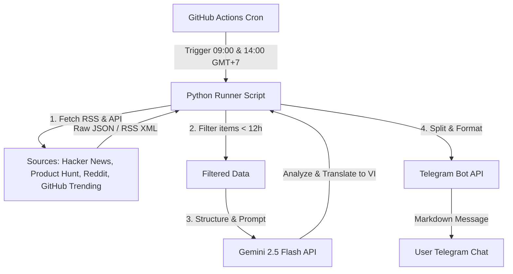

# Design Spec: AI Idea Research & Telegram Reporter Bot

System designed to automatically discover, analyze, and report business, technology, and YouTube content ideas using Python, Gemini API, and GitHub Actions, delivering twice daily to a Telegram chat.

---

## 1. System Architecture & Components



The system comprises three main components:
1. **Data Harvester**: A Python module using public endpoints/scrapers to fetch raw feed data.
2. **AI Analyzer**: An integration with Google Gemini 2.5 Flash to filter, translate, and rate ideas.
3. **Telegram Publisher**: A helper to format messages into valid MarkdownV2 or HTML and publish them via the Telegram Bot API.

---

## 2. Scraping & Data Sources

The bot gathers data from the following endpoints:
* **Hacker News**: Algolia Search API (`https://hn.algolia.com/api/v1/search_by_date?tags=story&numericFilters=created_at_i>{timestamp}&hitsPerPage=50`)
* **Product Hunt**: RSS Feed (`https://www.producthunt.com/feed`) parsed using `feedparser`.
* **Reddit**: Subreddits `r/sideproject` and `r/saas` fetched using JSON endpoint (`https://www.reddit.com/r/sideproject/new.json?limit=30` and `https://www.reddit.com/r/saas/new.json?limit=30`).
* **GitHub Trending**: Scrapes `https://github.com/trending` using `BeautifulSoup4` to get repositories, descriptions, and daily star delta.

### Deduplication and Time Range
* The script runs twice a day. To avoid duplicate ideas, the data collection step filters items based on their creation time, keeping only items posted in the **last 12 hours** (or 24 hours if running after a weekend / fallback, but default is 12 hours).

---

## 3. Gemini AI Analysis Prompt & Formatting

All collected raw inputs (titles, links, summaries) are bundled into a prompt sent to `gemini-2.5-flash`. The prompt instructs the model to filter the noise and output exactly **5 high-quality ideas for each of the 3 fields**:

1. **Kinh doanh & SaaS**: Potential micro-SaaS, side-hustles, or software business opportunities.
2. **Công nghệ & Open-Source**: Interesting libraries, repositories, or AI tools.
3. **Ý tưởng làm YouTube / Content**: Creative angles, script outlines, or thumbnails based on the current trends.

### Structured Output Format (Vietnamese)
The AI must respond in clean Markdown conforming to this template:
```markdown
💡 I. KINH DOANH & SAAS (5 ý tưởng nổi bật)
1. [Tên ý tưởng] ([Nguồn](link))
   - Tóm tắt: [Tóm tắt ngắn gọn]
   - Tiềm năng kinh doanh: [Điểm/10] - [Lý do ngắn gọn]
   - Khả năng code bằng AI: [Điểm/10] - [Gợi ý cách code nhanh]

🛠 II. CÔNG NGHỆ & OPEN-SOURCE (5 ý tưởng nổi bật)
1. [Tên dự án/Công cụ] ([Nguồn](link))
   - Tóm tắt tính năng: [Tóm tắt ngắn gọn]
   - Khả năng ứng dụng: [Gợi ý cách áp dụng vào công việc/dự án cá nhân]
   - Gợi ý techstack làm bằng AI: [Cursor / Lovable / Bolt.new]

📹 III. Ý TƯỞNG KÊNH YOUTUBE & CONTENT (5 ý tưởng nổi bật)
1. [Tiêu đề video gợi ý]
   - Chủ đề cốt lõi: [Chủ đề công nghệ/kinh doanh đang hot làm gốc]
   - Kịch bản/Góc tiếp cận: [Gợi ý cách làm video thu hút người xem]
   - Tiêu đề & Thumbnail gợi ý: [Gợi ý nhanh]
```

---

## 4. Telegram Publisher & Error Handling

* **Telegram Character Limit**: Telegram limits standard messages to **4096 characters**. The script will automatically split the generated markdown report into parts (e.g., sending each of the 3 categories as a separate message) if it exceeds this threshold.
* **API Credentials**: Secured via GitHub Secrets:
  * `TELEGRAM_BOT_TOKEN`
  * `TELEGRAM_CHAT_ID`
  * `GEMINI_API_KEY`

---

## 5. Automation Workflow (GitHub Actions)

A GitHub Workflow `.github/workflows/daily_report.yml` is configured with a cron trigger:
* **9:00 AM VN Time (02:00 UTC)**: `0 2 * * *`
* **2:00 PM VN Time (07:00 UTC)**: `0 7 * * *`

```yaml
name: Daily AI Idea Research Report

on:
  schedule:
    - cron: '0 2 * * *'  # 9:00 AM VN Time
    - cron: '0 7 * * *'  # 2:00 PM VN Time
  workflow_dispatch:      # Allows manual trigger

jobs:
  run-report:
    runs-on: ubuntu-latest
    steps:
      - name: Checkout repository
        uses: actions/checkout@v4

      - name: Set up Python
        uses: actions/setup-python@v5
        with:
          python-python-version: '3.11'
          cache: 'pip'

      - name: Install dependencies
        run: |
          pip install requests feedparser beautifulsoup4 google-genai

      - name: Run research script
        env:
          TELEGRAM_BOT_TOKEN: ${{ secrets.TELEGRAM_BOT_TOKEN }}
          TELEGRAM_CHAT_ID: ${{ secrets.TELEGRAM_CHAT_ID }}
          GEMINI_API_KEY: ${{ secrets.GEMINI_API_KEY }}
        run: python src/main.py
```

---

## 6. Verification Plan

### Automated/Local Tests
* Run script manually using dummy environment variables pointing to test Telegram bot & channels:
  `python src/main.py`
* Verify scraping outputs for each provider by running a debug mode (`python src/main.py --debug`).

### Manual Verification
* Ensure Telegram messages are correctly formatted and fit within the character limits.
* Ensure all links are clickable and point to the correct source.
